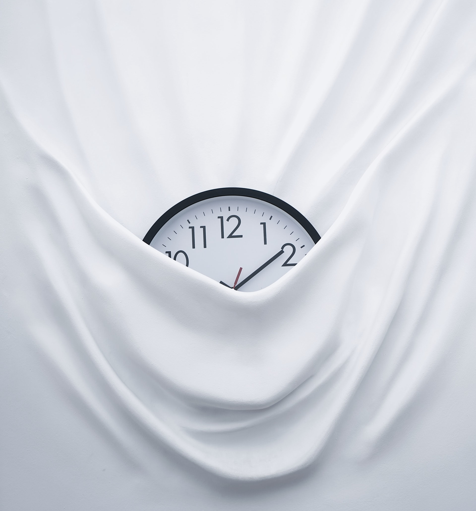

The Chronopsychiatry Research Group was established by 
Professor Daniel Smith at the University of Edinburgh, 
to drive forward research at the interface between mental health and 
sleep/circadian science.

Our <b>vision</b> is to initiate and drive high value collaborative research at the intersection of mental health science and sleep/circadian science. We will identify priority areas for research, establish standardised data collection and curation methods and launch new interdisciplinary collaborations. Our <b>long-term goal</b> is a sustainable infrastructure of researchers and clinicians in Edinburgh and internationally - including individuals with lived experience and researchers at different career stages and from different backgrounds - to drive innovation and impact in the nascent field of chronopsychiatry.

<h3>Why Chronopsychiatry?</h3>

Endogenous 24-hour (circadian) rhythms are found across almost all forms of life, from plants to humans. These rhythms exist at multiple molecular and cellular levels and allow organisms to optimally align physiology and behaviour to daily cycles of light and dark. Well-synchronised circadian rhythms are fundamental for human health and are extremely important for cognitive function and mental wellbeing. The correct timing of exposure to light is critical for keeping human circadian rhythms synchronised to the external environment. 
 
However, patterns of modern living (including shift-working and excess artificial light at night and sleep-disrupting drugs) cause desynchronization of rhythms and result in a wide range of adverse mental and physical health outcomes. This is particularly important for young people, who may be more sensitive to light-induced circadian dysfunction and associated mental health problems. 
 
Even though conditions such as depression, bipolar disorder and psychosis are associated with aberrant circadian and seasonal rhythms affecting sleep/wake cycles, the mechanisms of these associations remain poorly understood. Where important chronobiological discoveries have been made, the clinical application of these within mental health has been limited. More generally, the fundamental importance of healthy rhythms of sleep has historically been overlooked within public mental health initiatives.

<figcaption class="figure-caption">Photo by <a href="https://unsplash.com/@bfigas?utm_source=unsplash&utm_medium=referral&utm_content=creditCopyText">Bruno Figueiredo</a> on <a href="https://unsplash.com/s/photos/time?utm_source=unsplash&utm_medium=referral&utm_content=creditCopyText">Unsplash</a>
</figcaption>

