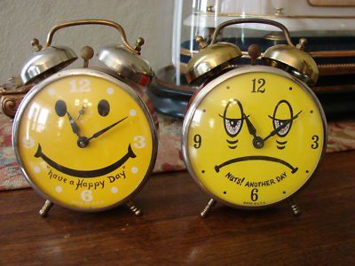



## About Chronopsychiatry group

Chronopsychiatry Research Group has been established by Professor Daniel Smith at the University of Edinburgh, to drive forward research at the interface between mental health and sleep/circadian science.

## Here are some useful links 





